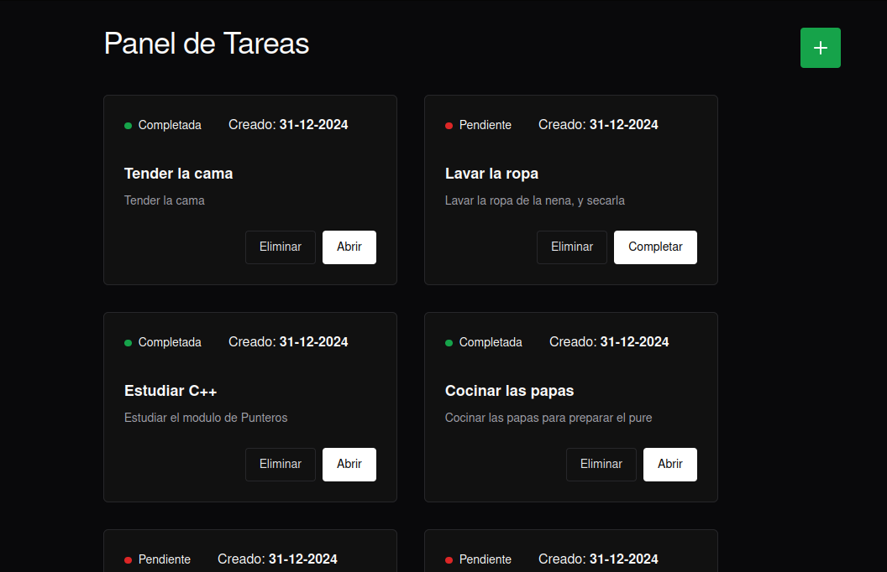

# Simple Task Manager
Simple task Manager es una pequeña aplicación para gestionar tareas pendientes, te permite crear tareas, mantener la lista e ir cerrando las tareas completadas



## Aplicacion para probar

- [Frontend App](https://lucky-fairy-e98c1c.netlify.app/)
- [Backend Api](https://simple-web-tasks.onrender.com/api/tasks)

## ¿Cómo correr la app?

Debes clonar el repositorio en tu computadora con el comando:

```bash
git clone https://github.com/jglopezre/simple-web-tasks.git
```

Con esto obtendras en tu computadora, el repositorio donde estan el frontend y el backend de la aplicacion en dos carpetas separadas, los comando que se describen a continuacion se deben realizar desde la carpeta *root* del repositorio.

## ¿Cómo utilizar el front end?

La app se puede correr localmente en modo desarrollador, para pruebas y modificaciones siguiendo los pasos a continuacion:

```bash
cd frontend && npm run dev
```
Con esto iniciaras Vite en modo desarrollador con *hot reload* para hacer las modificaciones requeridas

Si queres desplegar para producción, debes asegurarte que el archivo `.env.production` tenga los datos requeridos para conectar con la API alojada en el servidor, asegurando que el camppi `VITE_API_URL` apunte a la direccion donde esta alojada la API.

Podés construir un build con los siguientes pasos, y luego extraer la carpeta `frontend/dist/` donde estara la aplicación compilada lista para luego subirla al servidor o CDN.

```bash
cd frontend && npm run build
```
### ¿Cómo utilizar el backend?
Para correr el backend en local primero debes tener disponible una base de datos Mongo, ya sea corriendo de manera local, o tener una cuenta en algún servicio como [Mongo Atlas](https://www.mongodb.com/).
Con las credenciales de tu base de datos deberas crear un archivo `.env` que tenga los siguientes campos:

```bash
PORT=3001
DB_URL="URL de la bd con usuario y contraseña"
```

Una vez creado este archivo podes correr el sieguiente comando:

```bash
cd backend && npm run dev
```

Para compilar el backend para producción, se debe correr el siguiente comando:

```bash
cd backend && npm run build
```
Una vez compilado, solo deberas cargar el contenido de la carpeta `backend/dist` en una instancia de node, se debe configurar las variables de entorno como en el archivo `.env`. 

### Documentación Swagger

Para acceder a la documentación de la API, se debe ingresar a la ruta `/api/doc`.

## Stack Utilizado

### Backend
- [Express.Js](https://expressjs.com/)
- [Swagger](https://swagger.io/tools/swagger-ui/)
- [express-validator](https://express-validator.github.io/docs)
- [Mongoose](https://mongoosejs.com/)

### Frontend
- [React](https://es.react.dev/)
- [Vite](https://vite.dev/)
- [TanStack Query](https://tanstack.com/query/latest)
- [Axiosjs](https://axios-http.com/)
- [Chakra UI](https://www.chakra-ui.com/)

